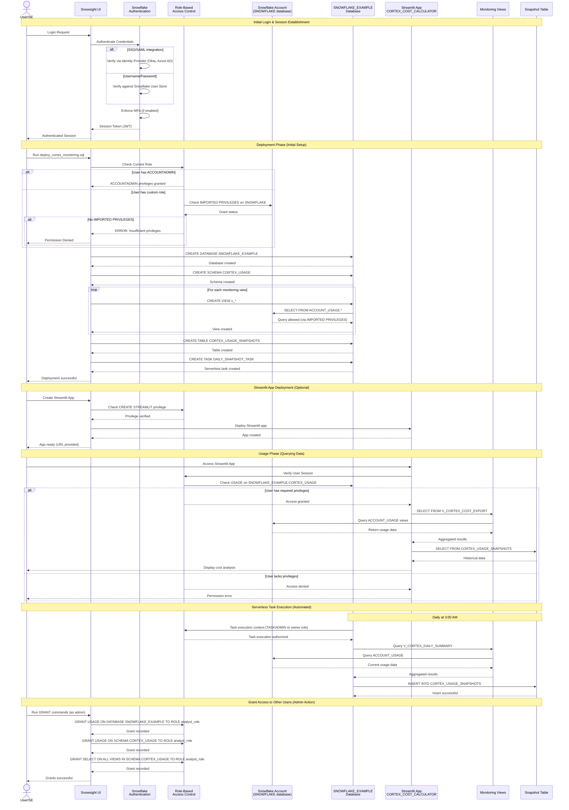

# Authentication Flow - Cortex Cost Calculator

**Author:** SE Community  
**Last Updated:** 2025-12-02  
**Expires:** 2025-12-25 (30 days from creation)  
**Status:** Reference Implementation

---


⚠️ **WARNING: This is a demonstration project. NOT FOR PRODUCTION USE.**

---

## Overview

This diagram illustrates the authentication and authorization flow for the Cortex Cost Calculator, including role-based access control (RBAC), privilege requirements, and security boundaries.

---

## Diagram



---

## Component Descriptions

### Authentication Layer

#### Snowflake Authentication Service
- **Purpose:** Verify user identity before granting access
- **Supported Methods:**
  - Username/Password (with optional MFA)
  - SSO/SAML (Okta, Azure AD, ADFS, etc.)
  - OAuth (for programmatic access)
  - Key-pair authentication (for service accounts)
- **Session Management:** JWT-based session tokens with configurable timeout
- **MFA Enforcement:** Account-level setting, can be role-specific
- **Location:** Snowflake cloud infrastructure (managed service)

#### Session Token (JWT)
- **Format:** JSON Web Token
- **Scope:** Binds user to authenticated session
- **Lifetime:** Configurable (default: 4 hours)
- **Revocation:** Automatic on logout or password change

### Authorization Layer

#### Role-Based Access Control (RBAC)
- **Purpose:** Enforce least-privilege access to Snowflake objects
- **Hierarchy:** Supports role inheritance (child roles inherit parent privileges)
- **Evaluation:** Every query checks current role's privileges
- **Location:** Snowflake metadata store

#### Required Privileges for Deployment

**Minimum Deployment Privileges:**
```sql
-- Option 1: Use ACCOUNTADMIN role (simplest)
USE ROLE ACCOUNTADMIN;

-- Option 2: Custom role with specific privileges
CREATE ROLE cortex_deployer;
GRANT IMPORTED PRIVILEGES ON DATABASE SNOWFLAKE TO ROLE cortex_deployer;
GRANT CREATE DATABASE ON ACCOUNT TO ROLE cortex_deployer;
GRANT USAGE ON WAREHOUSE compute_wh TO ROLE cortex_deployer;
GRANT ROLE cortex_deployer TO USER deployment_user;
```

**Breakdown:**
- `IMPORTED PRIVILEGES ON DATABASE SNOWFLAKE`: Access to ACCOUNT_USAGE views
- `CREATE DATABASE`: Ability to create SNOWFLAKE_EXAMPLE database
- `USAGE ON WAREHOUSE`: Compute resources to run deployment script
- `CREATE TASK`: Ability to create serverless snapshot task

#### Required Privileges for Usage (Read-Only Analyst)

```sql
-- Create read-only analyst role
CREATE ROLE cortex_analyst;

-- Grant access to monitoring database
GRANT USAGE ON DATABASE SNOWFLAKE_EXAMPLE TO ROLE cortex_analyst;
GRANT USAGE ON SCHEMA SNOWFLAKE_EXAMPLE.CORTEX_USAGE TO ROLE cortex_analyst;

-- Grant read access to all views
GRANT SELECT ON ALL VIEWS IN SCHEMA SNOWFLAKE_EXAMPLE.CORTEX_USAGE TO ROLE cortex_analyst;

-- Grant read access to snapshot table
GRANT SELECT ON TABLE SNOWFLAKE_EXAMPLE.CORTEX_USAGE.CORTEX_USAGE_SNAPSHOTS TO ROLE cortex_analyst;

-- Grant warehouse usage
GRANT USAGE ON WAREHOUSE compute_wh TO ROLE cortex_analyst;

-- Grant Streamlit app access (if deployed)
GRANT USAGE ON STREAMLIT SNOWFLAKE_EXAMPLE.CORTEX_USAGE.CORTEX_COST_CALCULATOR TO ROLE cortex_analyst;

-- Assign role to user
GRANT ROLE cortex_analyst TO USER analyst_user;
```

### Security Boundaries

#### Boundary 1: Account_Usage Access
- **Restriction:** Only roles with IMPORTED PRIVILEGES on SNOWFLAKE database can query ACCOUNT_USAGE
- **Reason:** ACCOUNT_USAGE contains sensitive usage telemetry across entire account
- **Impact:** Deploying user must have elevated privileges (ACCOUNTADMIN or custom role with this grant)

#### Boundary 2: Database & Schema Isolation
- **Restriction:** Users can only access objects in databases/schemas they've been granted USAGE on
- **Benefit:** Isolates monitoring objects in SNOWFLAKE_EXAMPLE database
- **Grant Pattern:**
  - USAGE on database → USAGE on schema → SELECT on views/tables

#### Boundary 3: Streamlit App RBAC
- **Restriction:** Users must be granted USAGE privilege on specific Streamlit app
- **Behavior:** App runs queries under user's current role
- **Validation:** App inherits user's privileges (can't bypass RBAC)

#### Boundary 4: Serverless Task Execution Context
- **Context:** Tasks run under role of task owner or TASKADMIN
- **Privilege Check:** Task must have SELECT on source views, INSERT on target table
- **Isolation:** Task execution is isolated from user sessions

---

## Authentication Workflows

### Workflow 1: SE Deploying in Customer Account

**Prerequisites:**
- SE has temporary access to customer account (time-limited)
- SE uses customer-approved role (often ACCOUNTADMIN for setup)
- SE follows least-privilege principle after deployment

**Flow:**
1. SE authenticates to customer account (SSO or provided credentials)
2. SE switches to deployment role (ACCOUNTADMIN or equivalent)
3. SE runs `deploy_cortex_monitoring.sql`
4. Deployment script creates:
   - Database: SNOWFLAKE_EXAMPLE
   - Schema: CORTEX_USAGE
   - Views: Query ACCOUNT_USAGE (requires IMPORTED PRIVILEGES)
   - Table: CORTEX_USAGE_SNAPSHOTS
   - Task: DAILY_SNAPSHOT_TASK (serverless)
5. SE validates deployment (queries return expected results)
6. SE optionally creates read-only analyst role for customer users
7. SE exits session (temporary access ends)

**Security Notes:**
- SE never sees customer data (views aggregate usage metrics only)
- Deployment objects are read-only (no data modification capability)
- Customer retains full control (can drop objects at any time)

### Workflow 2: Customer Self-Deployment

**Prerequisites:**
- Customer user has ACCOUNTADMIN or custom role with deployment privileges
- Active warehouse available for query execution

**Flow:**
1. Customer logs into Snowflake (SSO or credentials)
2. Customer runs `deploy_cortex_monitoring.sql` in Snowsight or SnowSQL
3. Script creates monitoring infrastructure in SNOWFLAKE_EXAMPLE database
4. Customer optionally deploys Streamlit app for interactive analysis
5. Customer grants access to other users via GRANT statements

**Security Notes:**
- Customer controls all access (standard Snowflake RBAC)
- No external data sharing required
- Audit trail in ACCOUNT_USAGE.QUERY_HISTORY

### Workflow 3: Automated Task Execution (Daily Snapshot)

**Context:** Serverless task runs daily at 3:00 AM without user interaction

**Flow:**
1. Snowflake task scheduler triggers DAILY_SNAPSHOT_TASK
2. Task runs under task owner's role (or TASKADMIN)
3. Task privilege check:
   - SELECT on V_CORTEX_DAILY_SUMMARY (requires USAGE on schema + SELECT on view)
   - INSERT on CORTEX_USAGE_SNAPSHOTS (requires INSERT on table)
4. Task queries monitoring view
5. Task inserts results into snapshot table
6. Task commits transaction
7. Task execution logged to ACCOUNT_USAGE.TASK_HISTORY

**Security Notes:**
- Task cannot be modified by non-owners
- Task execution context is isolated from user sessions
- Task must be explicitly resumed (ALTER TASK ... RESUME) to run

---

## Role Hierarchy & Privilege Escalation

### Standard Role Hierarchy

```
ACCOUNTADMIN (highest privilege)
    ├── SECURITYADMIN (user & role management)
    │   └── USERADMIN (user creation only)
    └── SYSADMIN (object creation & management)
        └── CUSTOM_ROLES (project-specific)
            └── cortex_deployer (deployment role)
            └── cortex_analyst (read-only role)
```

### Recommended Custom Roles

#### Deployment Role
```sql
CREATE ROLE cortex_deployer;
GRANT IMPORTED PRIVILEGES ON DATABASE SNOWFLAKE TO ROLE cortex_deployer;
GRANT CREATE DATABASE ON ACCOUNT TO ROLE cortex_deployer;
GRANT ROLE cortex_deployer TO ROLE SYSADMIN;
```

#### Read-Only Analyst Role
```sql
CREATE ROLE cortex_analyst;
GRANT USAGE ON DATABASE SNOWFLAKE_EXAMPLE TO ROLE cortex_analyst;
GRANT USAGE ON SCHEMA SNOWFLAKE_EXAMPLE.CORTEX_USAGE TO ROLE cortex_analyst;
GRANT SELECT ON ALL VIEWS IN SCHEMA SNOWFLAKE_EXAMPLE.CORTEX_USAGE TO ROLE cortex_analyst;
GRANT SELECT ON TABLE SNOWFLAKE_EXAMPLE.CORTEX_USAGE.CORTEX_USAGE_SNAPSHOTS TO ROLE cortex_analyst;
GRANT ROLE cortex_analyst TO ROLE SYSADMIN;
```

#### Power User Role (Can Deploy + Analyze)
```sql
CREATE ROLE cortex_poweruser;
GRANT ROLE cortex_deployer TO ROLE cortex_poweruser;
GRANT ROLE cortex_analyst TO ROLE cortex_poweruser;
GRANT ROLE cortex_poweruser TO ROLE SYSADMIN;
```

---

## Security Best Practices

### 1. Least Privilege Principle
- **Deploy with minimum required role** (not always ACCOUNTADMIN)
- **Grant read-only access** to users who only need to view data
- **Separate deployment from analysis** roles

### 2. Audit & Monitoring
- **Query History:** All queries logged in ACCOUNT_USAGE.QUERY_HISTORY
- **Access History:** Object access tracked in ACCOUNT_USAGE.ACCESS_HISTORY
- **Grant History:** Privilege changes tracked in ACCOUNT_USAGE.GRANTS_TO_ROLES

### 3. Multi-Factor Authentication
- **Recommendation:** Enable MFA for all users with elevated privileges
- **Configuration:**
  ```sql
  ALTER USER deployment_user SET MINS_TO_BYPASS_MFA = 0;
  ```

### 4. Session Management
- **Recommendation:** Use short session timeouts for sensitive roles
- **Configuration:**
  ```sql
  ALTER USER deployment_user SET MINS_TO_UNLOCK = 5;
  ALTER USER deployment_user SET MINS_TO_BYPASS_MFA = 0;
  ```

### 5. Network Policies
- **Recommendation:** Restrict ACCOUNTADMIN access to corporate IP ranges
- **Configuration:**
  ```sql
  CREATE NETWORK POLICY admin_only_from_office
    ALLOWED_IP_LIST = ('203.0.113.0/24');
  
  ALTER USER deployment_user SET NETWORK_POLICY = admin_only_from_office;
  ```

---

## Common Authentication Issues & Solutions

### Issue 1: "Object does not exist" on ACCOUNT_USAGE

**Cause:** User lacks IMPORTED PRIVILEGES on SNOWFLAKE database

**Solution:**
```sql
USE ROLE ACCOUNTADMIN;
GRANT IMPORTED PRIVILEGES ON DATABASE SNOWFLAKE TO ROLE <user_role>;
```

### Issue 2: "Insufficient privileges to operate on database"

**Cause:** User lacks CREATE DATABASE privilege

**Solution:**
```sql
USE ROLE ACCOUNTADMIN;
GRANT CREATE DATABASE ON ACCOUNT TO ROLE <user_role>;
```

### Issue 3: "Cannot access Streamlit app"

**Cause:** User not granted USAGE on Streamlit object

**Solution:**
```sql
GRANT USAGE ON STREAMLIT CORTEX_COST_CALCULATOR TO ROLE <user_role>;
```

### Issue 4: "Views return no data"

**Cause:** User's role can query views, but views query ACCOUNT_USAGE (which requires IMPORTED PRIVILEGES)

**Solution:**
- Views run as definer (owner), not invoker
- Ensure view owner role has IMPORTED PRIVILEGES
- Alternative: Grant IMPORTED PRIVILEGES to user's role

---

## CSV Export Security (SE Workflow)

### Data Classification
- **Data Type:** Aggregated usage metrics (credits, request counts, timestamps)
- **Sensitivity:** Medium (no customer PII, but reveals usage patterns)
- **Recommended Handling:** Treat as Snowflake Confidential

### Export Authorization
- **Who Can Export:** Users with SELECT privilege on V_CORTEX_COST_EXPORT view
- **Audit Trail:** Export queries logged in QUERY_HISTORY
- **Recommendation:** Limit export privilege to SE users who need it

### Transfer Security
- **Method:** Manual download from Snowsight (HTTPS)
- **Storage:** Transient (delete after uploading to SE calculator)
- **Encryption:** Data encrypted in transit (TLS 1.2+)

---

## Change History

Last Updated: 2025-11-12

