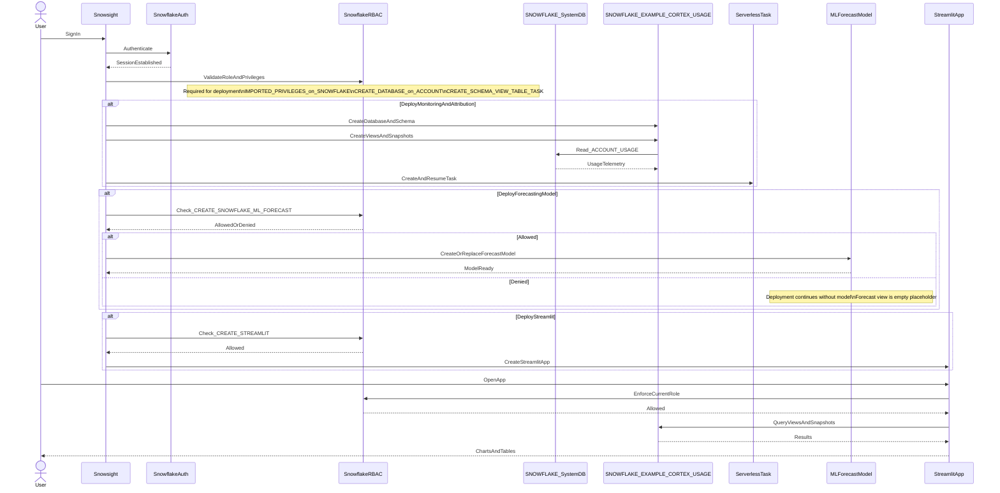

# Auth Flow - Cortex Trail
Author: SE Community
Last Updated: 2026-01-05
Expires: See deploy_all.sql (single source of truth)
Status: Reference Implementation

Reference Implementation: This code demonstrates production-grade architectural patterns and best practices. Review and customize security, networking, and logic for your organization's specific requirements before deployment.

## Overview
This diagram shows authentication and authorization for Cortex Trail. Users authenticate to Snowflake, then RBAC controls the ability to deploy (create schema objects, tasks, and optionally an ML forecast model) and to query the views and Streamlit app.

## Component Descriptions
- **SnowflakeAuth**: Handles user authentication (SSO/MFA/password). Provides an authenticated Snowsight session.
- **SnowflakeRBAC**: Enforces permissions for deployment and usage (USAGE/SELECT on objects; CREATE privileges for deployment).
- **SNOWFLAKE_SystemDB**: Hosts `ACCOUNT_USAGE` sources; access requires `IMPORTED PRIVILEGES` on database `SNOWFLAKE`.
- **SNOWFLAKE_EXAMPLE_CORTEX_USAGE**: Project schema where views, snapshots, and the optional forecast model live.
- **StreamlitApp**: Runs queries under the user's current role; cannot bypass RBAC.

## Change History
See git history for changes to this diagram.
