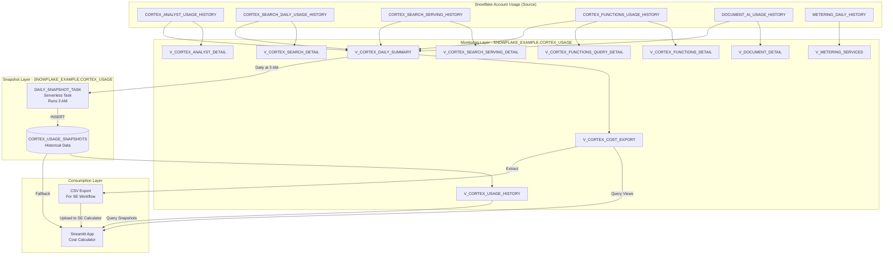

# Data Flow - Cortex Cost Calculator

**Author:** SE Community  
**Last Updated:** 2025-12-02  
**Expires:** 2025-12-25 (30 days from creation)  
**Status:** Reference Implementation

---


⚠️ **WARNING: This is a demonstration project. NOT FOR PRODUCTION USE.**

---

## Overview

This diagram shows how Cortex usage data flows from Snowflake's ACCOUNT_USAGE views through monitoring views, snapshot tables, and ultimately into the Streamlit cost calculator for analysis and forecasting.

---

## Diagram



---

## Component Descriptions

### Source Layer: Snowflake ACCOUNT_USAGE

- **CORTEX_ANALYST_USAGE_HISTORY:** Per-request usage for Cortex Analyst (semantic model queries)
- **CORTEX_SEARCH_DAILY_USAGE_HISTORY:** Daily aggregated usage for Cortex Search services
- **CORTEX_SEARCH_SERVING_HISTORY:** Hourly serving costs for active Cortex Search services
- **CORTEX_FUNCTIONS_USAGE_HISTORY:** Hourly aggregated usage for LLM functions (Complete, Summarize, etc.)
- **DOCUMENT_AI_USAGE_HISTORY:** Per-request usage for Document AI processing
- **METERING_DAILY_HISTORY:** Service-level credit consumption for validation
- **Technology:** Snowflake ACCOUNT_USAGE schema (45 min - 3 hour latency)
- **Location:** `SNOWFLAKE.ACCOUNT_USAGE.*`
- **Dependencies:** Requires IMPORTED PRIVILEGES on SNOWFLAKE database

### Monitoring Layer: CORTEX_USAGE Views

- **Purpose:** Translate raw ACCOUNT_USAGE data into analytics-ready format
- **Technology:** SQL views with filtering, aggregation, and enrichment
- **Location:** `sql/deploy_cortex_monitoring.sql`
- **Dependencies:** ACCOUNT_USAGE access, 7-14 days of Cortex usage recommended
- **Key Views:**
  - `V_CORTEX_ANALYST_DETAIL`: User-level Analyst query tracking
  - `V_CORTEX_SEARCH_DETAIL`: Daily Search service costs
  - `V_CORTEX_SEARCH_SERVING_DETAIL`: Hourly Search serving costs
  - `V_CORTEX_FUNCTIONS_DETAIL`: LLM function usage by model
  - `V_CORTEX_FUNCTIONS_QUERY_DETAIL`: Query-level LLM tracking (v2.6)
  - `V_DOCUMENT_DETAIL`: Document processing by operation type
  - `V_CORTEX_DAILY_SUMMARY`: Rollup across all services (primary aggregation)
  - `V_CORTEX_COST_EXPORT`: Pre-formatted for calculator consumption
  - `V_METERING_SERVICES`: High-level validation view
  - `V_CORTEX_USAGE_HISTORY`: Includes week-over-week trends from snapshots

### Snapshot Layer: Historical Tracking

- **CORTEX_USAGE_SNAPSHOTS Table:** Permanent table storing daily snapshots
- **Purpose:** 4-5x faster queries, historical tracking beyond 90-day rolling window
- **Technology:** Permanent table with daily inserts via serverless task
- **Location:** `SNOWFLAKE_EXAMPLE.CORTEX_USAGE.CORTEX_USAGE_SNAPSHOTS`
- **Retention:** Unlimited (user manages via cleanup)
- **DAILY_SNAPSHOT_TASK:** Serverless task running daily at 3:00 AM
- **Cost:** ~$0.30-$1.50/month (serverless compute)
- **Logic:** Captures V_CORTEX_DAILY_SUMMARY daily aggregates

### Consumption Layer: Analytics

- **Streamlit App:** Interactive cost calculator and forecasting tool
- **Technology:** Streamlit in Snowflake, Python, Plotly visualizations
- **Location:** `streamlit/cortex_cost_calculator/streamlit_app.py`
- **Data Sources:**
  1. Direct query to views (same-account deployment)
  2. CSV upload (SE workflow for customer data)
  3. Snapshot table fallback (for historical trends)
- **Features:**
  - Historical analysis with time series charts
  - Multi-scenario cost projections (3, 6, 12, 24 months)
  - Cost per user calculator
  - Budget capacity planning
  - Export-ready credit estimates

- **CSV Export:** For Solutions Engineers analyzing customer accounts
- **Technology:** SQL query results via `sql/export_metrics.sql`
- **Format:** Pre-formatted CSV matching calculator upload schema
- **Workflow:** Extract from customer account → Upload to SE's calculator

---

## Data Transformations

| Stage | Input | Transformation | Output | Frequency |
|-------|-------|----------------|--------|-----------|
| Monitoring | ACCOUNT_USAGE | Filter, aggregate, enrich with lookback period | Monitoring views | Real-time query |
| Snapshot | V_CORTEX_DAILY_SUMMARY | Daily capture via serverless task | CORTEX_USAGE_SNAPSHOTS | Daily at 3 AM |
| Analytics | Views + Snapshots | Python/Pandas analysis, Plotly charts | Interactive dashboards | On-demand |
| Export | V_CORTEX_COST_EXPORT | Format for CSV upload | SE workflow file | On-demand |

---

## Data Flow Patterns

### Pattern 1: Same-Account Deployment (Customer)

```
ACCOUNT_USAGE → Monitoring Views → Snapshot Task → Streamlit App
```

- Real-time queries to views
- Automatic daily snapshots
- Historical trend analysis from snapshots
- No data export needed

### Pattern 2: SE Workflow (Two Accounts)

```
Customer Account:
  ACCOUNT_USAGE → Monitoring Views → CSV Export

SE Account:
  CSV Upload → Streamlit App → Cost Analysis
```

- Deploy monitoring in customer account
- Wait 7-14 days for usage data
- Extract CSV with `export_metrics.sql`
- Upload to SE's calculator for analysis
- Generate projections and estimates

### Pattern 3: Smart Data Fallback (v2.0+)

```
Streamlit App Query Logic:
  1. Try CORTEX_USAGE_SNAPSHOTS (fast, if exists)
  2. Fallback to V_CORTEX_DAILY_SUMMARY (always works)
  3. Display results from either source
```

- Best of both: speed when available, always functional
- Works immediately after deployment (before first 3 AM snapshot)

---

## Data Quality & Validation

### Expected Data Latency

- **ACCOUNT_USAGE:** 45 minutes to 3 hours after actual usage
- **Monitoring Views:** Reflects ACCOUNT_USAGE latency
- **Snapshot Table:** Next day at 3 AM (D+1)
- **Recommendation:** Wait 7-14 days for meaningful historical analysis

### Validation Checks

1. **Cross-validation:** Compare `V_CORTEX_DAILY_SUMMARY` credits with `V_METERING_SERVICES`
2. **Completeness:** Verify all Cortex services showing usage (if applicable)
3. **User tracking:** Validate user-level attribution where available
4. **Historical trends:** Check week-over-week growth in `V_CORTEX_USAGE_HISTORY`

---

## Change History

See `.cursor/docs/DIAGRAM_CHANGELOG.md` for version history.

