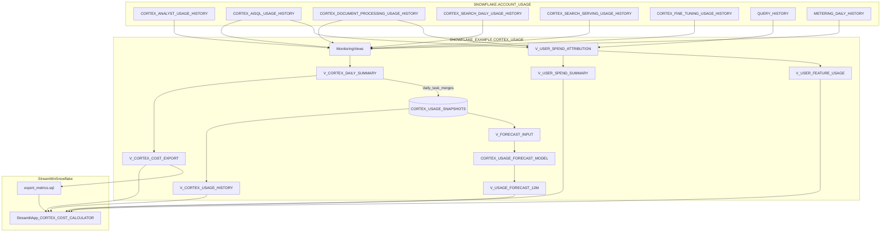

# Data Flow - Cortex Trail
Author: SE Community
Last Updated: 2026-01-05
Expires: See deploy_all.sql (single source of truth)
Status: Reference Implementation

Reference Implementation: This code demonstrates production-grade architectural patterns and best practices. Review and customize security, networking, and logic for your organization's specific requirements before deployment.

## Overview
This diagram shows how Cortex usage telemetry flows from Snowflake `ACCOUNT_USAGE` into project views and snapshots in `SNOWFLAKE_EXAMPLE.CORTEX_USAGE`, then into two primary outcomes: user spend attribution (user to feature to credits) and a 12-month forecast of credits by service.

## Component Descriptions
- **AccountUsage**: Read-only system views providing authoritative usage/credit telemetry. Location: `SNOWFLAKE.ACCOUNT_USAGE.*`.
- **MonitoringViews**: SQL views that normalize and aggregate per-service usage, then roll into `V_CORTEX_DAILY_SUMMARY`. Location: `sql/01_deployment/deploy_cortex_monitoring.sql`.
- **UserAttribution**: Views that attribute usage to `USER_NAME` by joining usage (via `QUERY_ID`) to `QUERY_HISTORY`. Location: `sql/01_deployment/deploy_cortex_monitoring.sql`.
- **SnapshotsAndHistory**: Daily snapshots stored in `CORTEX_USAGE_SNAPSHOTS`, queried via `V_CORTEX_USAGE_HISTORY` for faster historical analysis and longer retention.
- **Forecasting**: `V_FORECAST_INPUT` aggregates daily credits by service from snapshots, trains `CORTEX_USAGE_FORECAST_MODEL`, and exposes results in `V_USAGE_FORECAST_12M`.
- **StreamlitApp**: Interactive UI that answers the two primary questions (user attribution and 12-month forecast). Location: `streamlit/cortex_cost_calculator/streamlit_app.py`.

## Change History
See git history for changes to this diagram.
