# Data Model - Cortex Cost Calculator

**Author:** SE Community  
**Last Updated:** 2025-12-02  
**Expires:** 2025-12-25 (30 days from creation)  
**Status:** Reference Implementation

---


⚠️ **WARNING: This is a demonstration project. NOT FOR PRODUCTION USE.**

This code demonstrates production-grade architectural patterns and best practices. Review and customize security, networking, and logic for your organization's specific requirements before deployment.

---

## Overview

This diagram shows the data model for the Cortex Cost Calculator, including the source ACCOUNT_USAGE views, the monitoring layer views, and the snapshot table that stores historical usage data.

---

## Diagram

```mermaid
erDiagram
    %% Source Layer - Snowflake ACCOUNT_USAGE (Read-Only)
    CORTEX_ANALYST_USAGE_HISTORY ||--o{ V_CORTEX_ANALYST_DETAIL : "queries"
    CORTEX_SEARCH_DAILY_USAGE_HISTORY ||--o{ V_CORTEX_SEARCH_DETAIL : "queries"
    CORTEX_SEARCH_SERVING_USAGE_HISTORY ||--o{ V_CORTEX_SEARCH_SERVING_DETAIL : "queries"
    CORTEX_FUNCTIONS_USAGE_HISTORY ||--o{ V_CORTEX_FUNCTIONS_DETAIL : "queries"
    CORTEX_FUNCTIONS_USAGE_HISTORY ||--o{ V_AISQL_FUNCTION_SUMMARY : "aggregates"
    CORTEX_FUNCTIONS_QUERY_USAGE_HISTORY ||--o{ V_CORTEX_FUNCTIONS_QUERY_DETAIL : "queries"
    DOCUMENT_AI_USAGE_HISTORY ||--o{ V_DOCUMENT_AI_DETAIL : "queries"
    CORTEX_DOCUMENT_PROCESSING_USAGE_HISTORY ||--o{ V_CORTEX_DOCUMENT_PROCESSING_DETAIL : "queries"
    CORTEX_FINE_TUNING_USAGE_HISTORY ||--o{ V_CORTEX_FINE_TUNING_DETAIL : "queries"
    METERING_DAILY_HISTORY ||--o{ V_METERING_AI_SERVICES : "queries"
    
    %% Monitoring Layer Views
    V_CORTEX_ANALYST_DETAIL ||--o{ V_CORTEX_DAILY_SUMMARY : "aggregates_into"
    V_CORTEX_SEARCH_DETAIL ||--o{ V_CORTEX_DAILY_SUMMARY : "aggregates_into"
    V_CORTEX_SEARCH_SERVING_DETAIL ||--o{ V_CORTEX_DAILY_SUMMARY : "aggregates_into"
    V_CORTEX_FUNCTIONS_DETAIL ||--o{ V_CORTEX_DAILY_SUMMARY : "aggregates_into"
    V_CORTEX_DOCUMENT_PROCESSING_DETAIL ||--o{ V_CORTEX_DAILY_SUMMARY : "aggregates_into"
    V_CORTEX_FINE_TUNING_DETAIL ||--o{ V_CORTEX_DAILY_SUMMARY : "aggregates_into"
    
    V_CORTEX_DAILY_SUMMARY ||--o{ V_CORTEX_COST_EXPORT : "exports"
    V_CORTEX_DAILY_SUMMARY ||--o{ CORTEX_USAGE_SNAPSHOTS : "materialized_by_task"
    
    %% Snapshot and History Views
    CORTEX_USAGE_SNAPSHOTS ||--o{ V_CORTEX_USAGE_HISTORY : "queries"
    
    %% Source Layer Schemas (Read-Only)
    CORTEX_ANALYST_USAGE_HISTORY {
        timestamp_ltz start_time
        timestamp_ltz end_time
        number request_count
        number credits
        text username
    }
    
    CORTEX_SEARCH_DAILY_USAGE_HISTORY {
        timestamp_ltz usage_date
        varchar database_name
        varchar schema_name
        varchar service_name
        number service_id
        varchar consumption_type
        number credits
        varchar model_name
        varchar tokens
    }
    
    CORTEX_FUNCTIONS_USAGE_HISTORY {
        timestamp_ltz start_time
        timestamp_ltz end_time
        varchar function_name
        varchar model_name
        number warehouse_id
        number token_credits
        number tokens
    }
    
    CORTEX_FUNCTIONS_QUERY_USAGE_HISTORY {
        varchar function_name
        varchar model_name
        varchar query_id
        number tokens
        number token_credits
        varchar warehouse_id
    }
    
    CORTEX_DOCUMENT_PROCESSING_USAGE_HISTORY {
        varchar query_id
        number credits_used
        timestamp_ltz start_time
        timestamp_ltz end_time
        text function_name
        text model_name
        text operation_name
        number page_count
        number document_count
        number feature_count
    }
    
    CORTEX_FINE_TUNING_USAGE_HISTORY {
        timestamp_ltz start_time
        timestamp_ltz end_time
        number warehouse_id
        varchar model_name
        number token_credits
        number tokens
    }
    
    %% Snapshot Table (SNOWFLAKE_EXAMPLE.CORTEX_USAGE)
    CORTEX_USAGE_SNAPSHOTS {
        date snapshot_date "NOT NULL - Date snapshot was captured"
        varchar service_type "NOT NULL - Cortex service name"
        date usage_date "NOT NULL - Date of usage"
        number daily_unique_users "Count of unique users"
        number total_operations "Total operations/requests"
        number total_credits "Total credits consumed"
        number credits_per_user "Average credits per user"
        number credits_per_operation "Average credits per operation"
        varchar function_name "AISQL function name (nullable)"
        varchar model_name "Model name (nullable)"
        number total_tokens "Total tokens processed"
        number cost_per_million_tokens "Cost per 1M tokens"
        number serverless_calls "Count of serverless calls"
        number compute_calls "Count of warehouse calls"
        number total_pages_processed "Document pages processed"
        number total_documents_processed "Documents processed"
        number credits_per_page "Credits per page"
        number credits_per_document "Credits per document"
        timestamp_ltz inserted_at "Record creation timestamp"
    }
```



---

## Component Descriptions

### Source Layer (SNOWFLAKE.ACCOUNT_USAGE)

**Purpose:** Snowflake system views providing usage and billing data  
**Technology:** Snowflake ACCOUNT_USAGE schema (read-only)  
**Location:** `SNOWFLAKE.ACCOUNT_USAGE.*`  
**Dependencies:** IMPORTED PRIVILEGES on SNOWFLAKE database  
**Data Retention:** 365 days (1 year)  
**Latency:** 45 minutes to 3 hours from actual usage

---

### Monitoring Layer (SNOWFLAKE_EXAMPLE.CORTEX_USAGE)

**Purpose:** Filtered, formatted views for Cortex service monitoring  
**Technology:** SQL views  
**Location:** `sql/deploy_cortex_monitoring.sql` (lines 15-442)  
**Dependencies:** ACCOUNT_USAGE views  
**View Count:** 16 views

#### Key Views:

1. **V_CORTEX_ANALYST_DETAIL** - Cortex Analyst usage with user tracking
2. **V_CORTEX_SEARCH_DETAIL** - Cortex Search daily usage
3. **V_CORTEX_SEARCH_SERVING_DETAIL** - Search serving hourly details
4. **V_CORTEX_FUNCTIONS_DETAIL** - LLM function usage by model (hourly)
5. **V_CORTEX_FUNCTIONS_QUERY_DETAIL** - Per-query function usage
6. **V_DOCUMENT_AI_DETAIL** - Legacy Document AI usage
7. **V_CORTEX_DOCUMENT_PROCESSING_DETAIL** - Modern document processing (v2.6)
8. **V_CORTEX_FINE_TUNING_DETAIL** - Fine-tuning training costs (v2.6)
9. **V_AISQL_FUNCTION_SUMMARY** - AISQL function aggregates
10. **V_AISQL_MODEL_COMPARISON** - Model performance comparison
11. **V_AISQL_DAILY_TRENDS** - Daily AISQL usage trends
12. **V_QUERY_COST_ANALYSIS** - Most expensive queries (v2.6)
13. **V_CORTEX_DAILY_SUMMARY** - Rollup across all services
14. **V_CORTEX_COST_EXPORT** - Pre-formatted for calculator export
15. **V_METERING_AI_SERVICES** - High-level AI services validation
16. **V_CORTEX_USAGE_HISTORY** - Historical snapshots with trends

---

### Storage Layer (SNOWFLAKE_EXAMPLE.CORTEX_USAGE)

#### CORTEX_USAGE_SNAPSHOTS Table

**Purpose:** Historical storage of daily usage metrics  
**Technology:** Snowflake table (PERMANENT)  
**Location:** `sql/deploy_cortex_monitoring.sql` (lines 453-478)  
**Update Frequency:** Daily at 3:00 AM via serverless task  
**Data Retention:** Indefinite (manual cleanup required)

**Key Features:**
- No clustering key (< 1 GB, not needed until > 1 TB)
- No primary key (nullable columns: function_name, model_name)
- Uniqueness enforced by MERGE logic in task
- Supports both aggregate and granular metrics (AISQL functions, document processing)

**Composite Key (Logical):**
- `snapshot_date` + `service_type` + `usage_date` + `function_name` + `model_name`

---

### Orchestration Layer

#### TASK_DAILY_CORTEX_SNAPSHOT

**Purpose:** Automated daily capture of usage metrics  
**Technology:** Snowflake serverless task  
**Location:** `sql/deploy_cortex_monitoring.sql` (lines 491-630)  
**Schedule:** CRON: `0 3 * * *` (3:00 AM Pacific Time)  
**Compute:** Serverless (XSMALL initial, max SMALL)  
**Cost Guardrails:** `SERVERLESS_TASK_MAX_STATEMENT_SIZE = 'SMALL'`

**Operation:**
- MERGE INTO CORTEX_USAGE_SNAPSHOTS
- Processes last 2 days of data (handles late-arriving data)
- Handles all service types: Analyst, Search, Functions, Document Processing, Fine-tuning

---

## Data Flow Summary

```
┌─────────────────────────────────────────────┐
│  SNOWFLAKE.ACCOUNT_USAGE (Source)           │
│  - CORTEX_ANALYST_USAGE_HISTORY             │
│  - CORTEX_SEARCH_DAILY_USAGE_HISTORY        │
│  - CORTEX_FUNCTIONS_USAGE_HISTORY           │
│  - CORTEX_DOCUMENT_PROCESSING_USAGE_HISTORY │
│  - CORTEX_FINE_TUNING_USAGE_HISTORY         │
│  - METERING_DAILY_HISTORY                   │
└─────────────────────────────────────────────┘
                    ↓ (queries)
┌─────────────────────────────────────────────┐
│  SNOWFLAKE_EXAMPLE.CORTEX_USAGE (Views)     │
│  - V_CORTEX_*_DETAIL (16 views)             │
│  - V_CORTEX_DAILY_SUMMARY (rollup)          │
└─────────────────────────────────────────────┘
                    ↓ (MERGE via task)
┌─────────────────────────────────────────────┐
│  CORTEX_USAGE_SNAPSHOTS (Table)             │
│  - Historical daily metrics                 │
│  - Function/model granularity               │
└─────────────────────────────────────────────┘
                    ↓ (queries)
┌─────────────────────────────────────────────┐
│  V_CORTEX_USAGE_HISTORY (View)              │
│  - Snapshot + trend analysis                │
│  - Week-over-week growth                    │
└─────────────────────────────────────────────┘
                    ↓ (consumed by)
┌─────────────────────────────────────────────┐
│  Streamlit Cost Calculator                  │
│  - Historical analysis                      │
│  - Cost projections                         │
│  - Budget planning                          │
└─────────────────────────────────────────────┘
```

---

## Schema Layers

### Layer 1: Source (Read-Only)
- **Schema:** `SNOWFLAKE.ACCOUNT_USAGE`
- **Object Count:** 9 views (Snowflake-managed)
- **Latency:** 45 min - 3 hours
- **Retention:** 365 days

### Layer 2: Monitoring (Views)
- **Schema:** `SNOWFLAKE_EXAMPLE.CORTEX_USAGE`
- **Object Count:** 16 views
- **Refresh:** Real-time (query-on-read)
- **Lookback:** 90 days (configurable via WHERE clauses)

### Layer 3: Storage (Materialized)
- **Schema:** `SNOWFLAKE_EXAMPLE.CORTEX_USAGE`
- **Object Count:** 1 table (CORTEX_USAGE_SNAPSHOTS)
- **Refresh:** Daily at 3 AM
- **Retention:** Indefinite

### Layer 4: Analytics (Derived Views)
- **Schema:** `SNOWFLAKE_EXAMPLE.CORTEX_USAGE`
- **Object Count:** Multiple views on snapshot table
- **Purpose:** Trend analysis, historical comparisons

---

## Relationships

### One-to-Many Relationships

| Parent | Child | Relationship |
|--------|-------|--------------|
| ACCOUNT_USAGE views | Monitoring views | Each source view feeds 1+ monitoring views |
| Monitoring views | V_CORTEX_DAILY_SUMMARY | All detail views aggregate into daily summary |
| V_CORTEX_DAILY_SUMMARY | CORTEX_USAGE_SNAPSHOTS | Daily summary materialized by task |
| CORTEX_USAGE_SNAPSHOTS | V_CORTEX_USAGE_HISTORY | Snapshot table queried by history view |

### No Foreign Keys

**Rationale:** This is a monitoring/analytical system with:
- Read-only source data (ACCOUNT_USAGE)
- Derived views (no stored data except snapshots)
- Nullable columns in snapshot table (function_name, model_name)
- Uniqueness enforced by MERGE logic, not constraints

---

## Data Types & Constraints

### CORTEX_USAGE_SNAPSHOTS Constraints

**NOT NULL columns:**
- `snapshot_date` - Date of snapshot capture
- `service_type` - Cortex service identifier
- `usage_date` - Date of actual usage

**Nullable columns:**
- `function_name` - NULL for non-AISQL services
- `model_name` - NULL for services without models
- All metric columns - NULL when not applicable to service type

**Uniqueness:**
- Enforced by MERGE ON clause in task (lines 600-604)
- Composite key: snapshot_date + service_type + usage_date + COALESCE(function_name, '') + COALESCE(model_name, '')

---

## Performance Considerations

### View Performance
- **Query Pruning:** All views use `WHERE date >= DATEADD('day', -90, ...)` for partition pruning
- **Sargable Predicates:** No functions wrapped around date columns in WHERE clauses
- **Specific Projection:** No SELECT * in production views

### Table Performance
- **Size:** < 1 GB (typical demo usage)
- **Clustering:** NOT recommended until > 1 TB
- **Potential Clustering Key:** `(usage_date, service_type)` at scale
- **Query Pattern:** Most queries filter by usage_date and service_type

### Task Performance
- **Initial Size:** XSMALL warehouse (minimal cost)
- **Auto-scaling:** Snowflake manages sizing based on history
- **Cost Guardrail:** MAX_STATEMENT_SIZE = SMALL prevents runaway costs
- **Execution Time:** Typically < 1 minute

---

## Change History

See `.cursor/DIAGRAM_CHANGELOG.md` for version history.

---

## Related Diagrams

- **Data Flow:** Shows how data moves through the system
- **Network Flow:** Shows Snowflake connectivity and access patterns
- **Auth Flow:** Shows RBAC and permission model

---

## Validation

**Schema Accuracy:** ✅ Verified against `sql/deploy_cortex_monitoring.sql`  
**Column Names:** ✅ Match actual DDL (lines 453-478)  
**Relationships:** ✅ Reflect actual view definitions  
**Last Validated:** 2025-11-21

