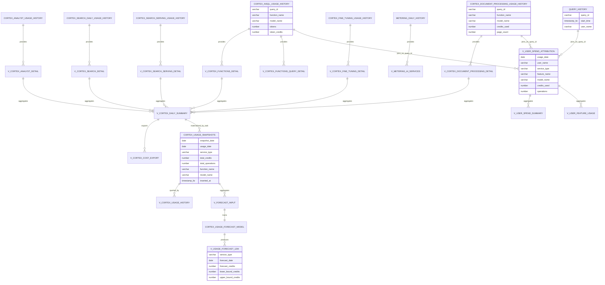

# Data Model - Cortex Trail
Author: SE Community
Last Updated: 2026-01-05
Expires: See deploy_all.sql (single source of truth)
Status: Reference Implementation

Reference Implementation: This code demonstrates production-grade architectural patterns and best practices. Review and customize security, networking, and logic for your organization's specific requirements before deployment.

## Overview
This diagram shows the data model for Cortex Trail, including the read-only `SNOWFLAKE.ACCOUNT_USAGE` sources, the monitoring and analytics views in `SNOWFLAKE_EXAMPLE.CORTEX_USAGE`, the snapshot table, and the ML-based forecasting model and outputs.

## Component Descriptions
- **AccountUsageSources**: Snowflake-managed usage/billing telemetry (read-only). Location: `SNOWFLAKE.ACCOUNT_USAGE.*`. Deps: `IMPORTED PRIVILEGES` on database `SNOWFLAKE`.
- **MonitoringAndSnapshots**: Project objects in `SNOWFLAKE_EXAMPLE.CORTEX_USAGE` created by `sql/01_deployment/deploy_cortex_monitoring.sql`. Stores historical metrics in `CORTEX_USAGE_SNAPSHOTS`.
- **UserAttributionViews**: `V_USER_SPEND_ATTRIBUTION`, `V_USER_SPEND_SUMMARY`, `V_USER_FEATURE_USAGE` attribute credits to users by joining usage to `QUERY_HISTORY` on `QUERY_ID`.
- **ForecastingModel**: `CORTEX_USAGE_FORECAST_MODEL` (Snowflake ML forecasting) trained from `V_FORECAST_INPUT` and exposed via `V_USAGE_FORECAST_12M`.
- **StreamlitApp**: UI reads rollups, attribution, and forecast views. Location: `streamlit/cortex_cost_calculator/streamlit_app.py`.

## Change History
See git history for changes to this diagram.
