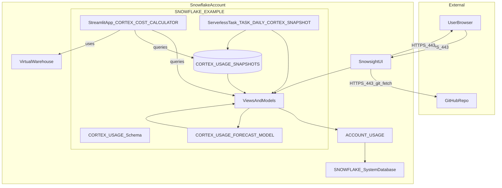

# Network Flow - Cortex Trail
Author: SE Community
Last Updated: 2026-01-05
Expires: 2026-07-05 (180 days from creation)
Status: Reference Implementation

Reference Implementation: This code demonstrates production-grade architectural patterns and best practices. Review and customize security, networking, and logic for your organization's specific requirements before deployment.

## Overview
This diagram shows the network connectivity for Cortex Trail. All analytics run natively inside Snowflake. External connectivity is limited to HTTPS access to Snowsight and optional GitHub access for Git-integrated deployment.

## Component Descriptions
- **UserBrowser**: End users access Snowsight and Streamlit over HTTPS (port 443).
- **SnowsightUI**: Primary UI for deployment and operation. Runs SQL worksheets and hosts Streamlit apps.
- **GitHubRepo**: Optional source for Git-integrated deployment (public repo fetch). No runtime dependency after objects are created.
- **ViewsAndModels**: Project views (monitoring, attribution, forecast outputs) and the ML forecasting model inside `SNOWFLAKE_EXAMPLE.CORTEX_USAGE`.
- **ServerlessTask_TASK_DAILY_CORTEX_SNAPSHOT**: Serverless task that merges daily metrics into `CORTEX_USAGE_SNAPSHOTS`.

## Change History
See `.cursor/DIAGRAM_CHANGELOG.md` for vhistory.

