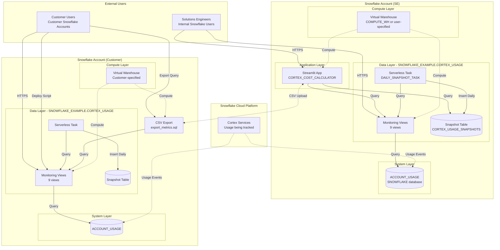

# Network Flow - Cortex Cost Calculator

**Author:** SE Community  
**Last Updated:** 2025-12-02  
**Expires:** 2025-12-25 (30 days from creation)  
**Status:** Reference Implementation

---


⚠️ **WARNING: This is a demonstration project. NOT FOR PRODUCTION USE.**

---

## Overview

This diagram shows the network architecture and component connectivity for the Cortex Cost Calculator, including Snowflake account access, Streamlit app deployment, and external integrations.

---

## Diagram



---

## Component Descriptions

### External Users

#### Solutions Engineers (SE)
- **Access Method:** Snowflake credentials (SSO/MFA)
- **Permissions Required:** 
  - USAGE on SNOWFLAKE_EXAMPLE database
  - USAGE on CORTEX_USAGE schema
  - SELECT on monitoring views
  - USAGE on Streamlit app
- **Typical Workflow:**
  1. Deploy monitoring in customer account
  2. Wait 7-14 days for data accumulation
  3. Extract CSV from customer account
  4. Upload CSV to calculator in SE account
  5. Generate cost estimates and projections

#### Customer Users
- **Access Method:** Customer Snowflake credentials
- **Permissions Required:**
  - ACCOUNTADMIN or IMPORTED PRIVILEGES on SNOWFLAKE database
  - CREATE DATABASE privilege
  - Active warehouse for query execution
- **Typical Workflow:**
  1. Deploy monitoring views in own account
  2. Deploy Streamlit app (optional)
  3. Query views for ongoing cost monitoring
  4. Use snapshot table for historical analysis

### Snowflake Account (SE)

#### Virtual Warehouse
- **Purpose:** Compute for Streamlit app and view queries
- **Size Recommendation:** SMALL (sufficient for interactive usage)
- **Auto-Suspend:** 60 seconds (minimize idle costs)
- **Cost:** ~$2-4/hour when active (depends on region/edition)

#### Streamlit App (CORTEX_COST_CALCULATOR)
- **Technology:** Streamlit in Snowflake (managed service)
- **Location:** Created in user-specified database/schema
- **Port:** Not applicable (Snowsight-hosted, HTTPS access)
- **Authentication:** Snowflake role-based access control (RBAC)
- **Dependencies:**
  - Python packages: streamlit, pandas, plotly
  - Access to monitoring views or CSV upload capability

#### Monitoring Views
- **Location:** `SNOWFLAKE_EXAMPLE.CORTEX_USAGE.*`
- **Technology:** SQL views (no data storage)
- **Query Pattern:** On-demand SELECT queries
- **Network:** Internal Snowflake metadata queries (no external calls)

#### Snapshot Table & Task
- **Table:** Permanent table storing daily aggregates
- **Task:** Serverless task (no warehouse required)
- **Schedule:** Daily at 3:00 AM account timezone
- **Network:** Internal Snowflake queries only

#### ACCOUNT_USAGE Database
- **Source:** Snowflake system database
- **Access:** Read-only via IMPORTED PRIVILEGES grant
- **Network:** Internal Snowflake metadata store
- **Latency:** 45 minutes to 3 hours

### Snowflake Account (Customer)

#### Data Layer
- **Identical structure to SE account:**
  - SNOWFLAKE_EXAMPLE database
  - CORTEX_USAGE schema
  - 9 monitoring views
  - Snapshot table
  - Serverless task

#### CSV Export
- **Mechanism:** SQL query results → Download as CSV
- **Format:** Pre-formatted for calculator upload
- **Security:** Transient (no persistent storage)
- **Transfer:** Manual download via Snowsight UI or SnowSQL CLI

### Snowflake Cloud Platform

#### Cortex Services (Usage Source)
- **Services Tracked:**
  - Cortex Analyst (semantic model queries)
  - Cortex Search (vector/hybrid search)
  - Cortex Functions (LLM: Complete, Summarize, Translate, etc.)
  - Document AI (OCR, PARSE_DOCUMENT)
- **Telemetry:** Usage events automatically logged to ACCOUNT_USAGE
- **Network:** Internal Snowflake telemetry pipeline

---

## Network Flow Patterns

### Pattern 1: SE Analyzing Customer Data (Two-Account Workflow)

```
Customer Account:
  1. SE deploys monitoring (HTTPS → Snowsight)
  2. Cortex usage → ACCOUNT_USAGE (internal)
  3. Views query ACCOUNT_USAGE (internal)
  4. SE extracts CSV (Snowsight download)

SE Account:
  5. SE uploads CSV (HTTPS → Streamlit app)
  6. App processes CSV (in-memory)
  7. App displays analysis (HTTPS → SE's browser)
```

**Network Boundaries Crossed:**
- HTTPS connections to Snowsight (both accounts)
- CSV file transfer (manual download/upload)

**Security Notes:**
- No direct account-to-account connection
- CSV is transient (not stored permanently)
- Access controlled via Snowflake RBAC

### Pattern 2: Customer Self-Service (Single-Account Workflow)

```
Customer Account:
  1. Customer deploys monitoring (HTTPS → Snowsight)
  2. Customer deploys Streamlit app (HTTPS → Snowsight)
  3. App queries views directly (internal)
  4. App queries snapshots (internal)
  5. Customer views analysis (HTTPS → browser)
```

**Network Boundaries Crossed:**
- HTTPS connections to Snowsight only

**Security Notes:**
- All data remains in customer account
- No data egress
- Standard Snowflake RBAC applies

### Pattern 3: Serverless Task Execution (Automated)

```
Snowflake Internal (Daily at 3 AM):
  1. Task triggered by schedule (internal)
  2. Task queries V_CORTEX_DAILY_SUMMARY (internal)
  3. Task inserts into CORTEX_USAGE_SNAPSHOTS (internal)
  4. Transaction commits
```

**Network Boundaries Crossed:** None (entirely internal)

**Security Notes:**
- Serverless compute (Snowflake-managed)
- No user interaction required
- Standard transactional guarantees

---

## Firewall & Security Groups

### Snowflake Network Security

**Inbound Access:**
- **Snowsight (HTTPS):** *.snowflakecomputing.com, port 443
- **Authentication:** SSO/MFA enforced at account level
- **IP Whitelisting:** Optional (via network policy)

**Outbound Access:**
- **None required:** All operations are internal to Snowflake
- **Exception:** CSV export is user-initiated download (browser)

**Network Policies (Optional):**
```sql
-- Example: Restrict access to corporate IP range
CREATE NETWORK POLICY corporate_access_only
  ALLOWED_IP_LIST = ('203.0.113.0/24', '198.51.100.0/24')
  BLOCKED_IP_LIST = ();

ALTER ACCOUNT SET NETWORK_POLICY = corporate_access_only;
```

### Data Egress Control

**CSV Export:**
- User-initiated download (intentional egress)
- Snowflake audit logs capture download events
- Use for SE workflow only (controlled process)

**Streamlit App:**
- No automatic data egress
- All processing in-account
- Export features are explicit user actions

---

## Ports & Protocols

| Service | Port | Protocol | Purpose |
|---------|------|----------|---------|
| Snowsight UI | 443 | HTTPS | Web interface for all interactions |
| Streamlit App | 443 | HTTPS | Hosted via Snowsight (no separate port) |
| SQL API | 443 | HTTPS | SnowSQL CLI and connectors |
| ACCOUNT_USAGE | N/A | Internal | Metadata queries (no external port) |
| Serverless Tasks | N/A | Internal | Scheduled execution (no external port) |

**Note:** All external access is via HTTPS (port 443) to Snowflake endpoints. Internal component communication does not expose network ports.

---

## Deployment Network Requirements

### Prerequisites
- **Network Access:** HTTPS (443) to *.snowflakecomputing.com
- **Authentication:** Valid Snowflake credentials
- **Firewall:** Allow outbound HTTPS to Snowflake domain
- **Proxy:** If corporate proxy required, configure Snowflake connector settings

### No External Dependencies
- No third-party API calls
- No external database connections
- No cloud storage mounts
- Self-contained within Snowflake account

---

## High Availability & Failover

### Snowflake Platform HA
- **Automatic:** Snowflake provides multi-AZ redundancy
- **No Configuration Required:** Built into platform
- **Recovery Time:** Transparent to users (seconds)

### Component Availability
- **Monitoring Views:** Available whenever ACCOUNT_USAGE is accessible
- **Snapshot Table:** Permanent table (standard Snowflake durability)
- **Streamlit App:** Snowflake-managed service (auto-restart on failure)
- **Serverless Task:** Automatic retry on transient failures

### Single Points of Failure
- **None for data access:** Multiple availability zones per Snowflake account
- **User browser:** If user's browser/network fails, simply reconnect
- **Warehouse suspension:** Auto-resume on query (no manual intervention)

---

## Performance Characteristics

### Query Latency
- **Monitoring Views:** 1-5 seconds (depends on lookback period)
- **Snapshot Table:** < 1 second (optimized for speed)
- **Streamlit App:** 2-10 seconds (includes rendering)
- **CSV Export:** 5-30 seconds (depends on data volume)

### Network Bandwidth
- **Monitoring Views:** Minimal (metadata queries, <1 MB typically)
- **Streamlit App:** 1-5 MB per session (charts + data)
- **CSV Export:** 100 KB - 10 MB (depends on usage history)

### Concurrency
- **Monitoring Views:** Unlimited read concurrency
- **Streamlit App:** Multiple concurrent users supported
- **Warehouse Sizing:** Scale up if many concurrent SE users

---

## Change History

See `.cursor/docs/DIAGRAM_CHANGELOG.md` for version history.

